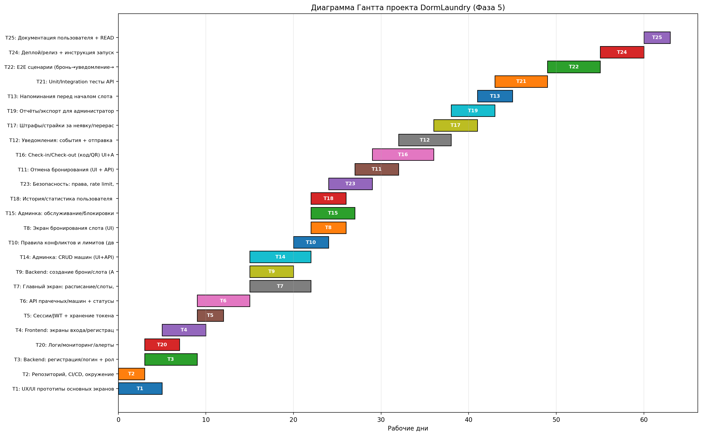

# Фаза 5. Планирование проекта DormLaundry

## 1) Ресурсы (неисчерпаемые типы) и их лимиты
- Frontend: 2
- Backend: 2
- DevOps: 1
- QA: 1
- Design: 1

## 2) Таблица «Задача – Use Case – Ресурс»
| № | Формулировка задачи | Связанный Use Case | Тип ресурса |
|---:|---|---|---|
| 1 | UX/UI прототипы основных экранов | UC: все (база) | Design |
| 2 | Настройка репозитория, CI/CD, окружения | Вне UC | DevOps |
| 3 | Backend: регистрация/логин + роли (user/admin) | UC01 | Backend |
| 4 | Frontend: экраны входа/регистрации | UC01 | Frontend |
| 5 | Механизм сессии/JWT + хранение токена | UC01 | Backend |
| 6 | Каталог прачечных/машин + статусы (API) | UC02 | Backend |
| 7 | Главный экран: расписание/слоты, статусы | UC02 | Frontend |
| 8 | Экран “забронировать слот” | UC03 | Frontend |
| 9 | Backend: создание брони/слота | UC03 | Backend |
| 10 | Проверка конфликтов (двойное бронирование, лимиты) | UC03 | Backend |
| 11 | Отмена бронирования (UI + API) | UC04 | Frontend, Backend |
| 12 | Уведомления: события + отправка (email/push) | UC06 | Backend, DevOps |
| 13 | Напоминания перед началом слота (scheduler) | UC06 | Backend |
| 14 | Админка: CRUD машин (UI+API) | UC07 | Frontend, Backend |
| 15 | Админка: расписание обслуживания/блокировки | UC07 | Backend |
| 16 | Check-in/Check-out (код/QR) | UC05 | Frontend, Backend |
| 17 | Штрафы/страйки за неявку | UC05/UC04 | Backend |
| 18 | История/статистика пользователя (UI) | UC08 | Frontend |
| 19 | Отчёты/экспорт для администратора | UC08 | Backend |
| 20 | Логи/мониторинг/алерты | Вне UC | DevOps |
| 21 | Unit/Integration тесты API | все | QA |
| 22 | E2E сценарии (бронь → уведомление → отмена) | ключевые UC | QA, Frontend |
| 23 | Безопасность: rate limit, права доступа | UC01/UC07 | Backend, DevOps |
| 24 | Деплой/релиз, инструкции запуска | Вне UC | DevOps |
| 25 | Документация пользователя + README | Вне UC | Смешанные |

## 3) Таблица «Задача – Ресурс – Ресурсные требования»
(здесь используем те же номера 1–25; требования — сколько людей данного типа нужно одновременно)

Пример: задача 11 требует 1 Frontend + 1 Backend; задача 12 требует 1 Backend + 1 DevOps и т.д.
(Точная таблица берётся из Excel/кода Colab.)

## 4) Таблица «Связи предшествования»
Например:
- 2 → 3,4,5 (сначала окружение/репо)
- 3 → 5 (сначала логин, потом сессия)
- 6 → 7 (API статусов → главный экран)
- 9,10 → 11 (создание/правила → отмена)
- 12,13 зависят от 9/11 (есть события брони)

(Полная таблица зависимостей берётся из Excel/кода Colab.)

## 5) Код и результаты
Ссылка на Colab: (https://colab.research.google.com/drive/1rmg0CdKwVV_oJmaUg3rWZrgNr7RHhnN-?usp=sharing)
Картинка Гантта: ()
Выводы: лучшая эвристика, длительность, критический путь, загрузка ресурсов.

